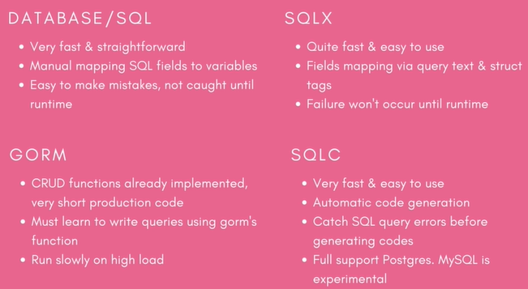

# Generate CRUD Golang from SQL with SQLC tool

## Compare SQL framework and tools in Golang


## Install SQLC tool
Website: https://sqlc.dev/

From Go: `go install github.com/kyleconroy/sqlc/cmd/sqlc@latest`


`.\sqlc.exe init`

Edit `sqlc.yaml` configuration file
```aidl
version: 1
packages:
  - path: "./db/sqlc"
    name: "db"
    engine: "postgresql"
    schema: "./db/migration/"
    queries: "./db/queries/"
    emit_json_tags: true
    emit_prepared_queries: false
    emit_interface: false
    emit_exact_table_names: true
```

Unfortunately, the SQLC Postgres does not support Windows
I will go to https://play.sqlc.dev/ to generate the Golang code
or I will use the Docker container of sqlc

docker run [OPTIONS] IMAGE [COMMAND] [ARG...]


```
docker run --name sqlc --rm -v `pwd`:`pwd` kjconroy/sqlc --help
docker run --name sqlc --rm -v `pwd`:`pwd` kjconroy/sqlc generate
docker run --rm -v $(pwd):/src -w /src kjconroy/sqlc generate
```
Note:
`--rm`: automatically remove container when it exits
`-w` ~ `--workdir`: Working directory inside the container
More ref: https://docs.docker.com/engine/reference/commandline/run/


## Compile Golang code
Before the code will compile, you’ll need to add the Go PostgreSQL driver
```aidl
go get github.com/lib/pq
go build ./...
```