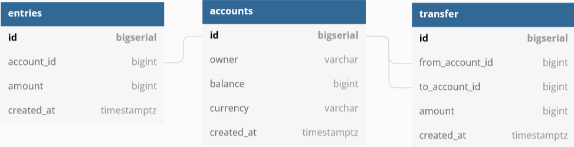

# Design Schema

## Database diagram
Go to: https://dbdiagram.io/d

### Table: Accounts
Accounts
Description: contains account owner info:
````
Table accounts as A {
    id bigserial [pk] // auto-increment
    owner varchar
    balance bigint
    currency varchar
    created_at timestamptz
}
````
`timestamptz` type helps to track time with the timezone
`bigserial` in Postgres can use at auto-increment value
### Table: Entries
***Description*** Entries table records all changes of `balance` in `table account`
```
Table entries {
    id bigserial [pk]
    account_id bigint [ref: > A.id] // foreign key is A.id
    amount bigint //amount changes from account: positive or negative
    created_at timestamptz [default: `now()`]
}
```
### Table: Transfers
TRANSFERS table helps us know which account transfer to which account
````
Table transfer {
    id bigserial [pk]
    from_account_id bigint [ref: > A.id] // foreign key is A.id
    to_account_id bigint [ref: > A.id] // foreign key is A.id
    amount bigint [not null, note:'must be positive'] //must be positive
    created_at timestamptz [not null, default: `now()`]
    
    Indexes {
        from_account_id
        to_account_id
        (from_account_id,to_account_id)
    }
}
````
### Using Index for searching by properties
We shoud add index to the properties that we need to search for in the tables
````
Indexes {
    account_id
}
````
## Generate Postgres SQL code
Export to simpleDB.sql
````
CREATE TABLE "accounts" (
  "id" bigserial PRIMARY KEY,
  "owner" varchar NOT NULL,
  "balance" bigint NOT NULL,
  "currency" varchar NOT NULL,
  "created_at" timestamptz NOT NULL DEFAULT (now())
);

CREATE TABLE "entries" (
  "id" bigserial PRIMARY KEY,
  "account_id" bigint,
  "amount" bigint NOT NULL,
  "created_at" timestamptz DEFAULT (now())
);

CREATE TABLE "transfer" (
  "id" bigserial PRIMARY KEY,
  "from_account_id" bigint,
  "to_account_id" bigint,
  "amount" bigint NOT NULL,
  "created_at" timestamptz NOT NULL DEFAULT (now())
);

CREATE INDEX ON "accounts" ("owner");

CREATE INDEX ON "entries" ("account_id");

CREATE INDEX ON "transfer" ("from_account_id");

CREATE INDEX ON "transfer" ("to_account_id");

CREATE INDEX ON "transfer" ("from_account_id", "to_account_id");

COMMENT ON COLUMN "entries"."amount" IS 'positive or negative';

COMMENT ON COLUMN "transfer"."amount" IS 'must be positive';

ALTER TABLE "entries" ADD FOREIGN KEY ("account_id") REFERENCES "accounts" ("id");

ALTER TABLE "transfer" ADD FOREIGN KEY ("from_account_id") REFERENCES "accounts" ("id");

ALTER TABLE "transfer" ADD FOREIGN KEY ("to_account_id") REFERENCES "accounts" ("id");

````