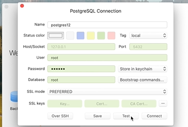

# Work with Postgres container
Check out https://hub.docker.com/_/postgres
## Init: Postgres database with Docker
```
docker images
docker run --name postgre14 -p 5432:5432 -e POSTGRES_PASSWORD=secret -d postgres:14-alpine
```
We choose the specific image ```postgres:14-alpine```
Expose container port 5232 map to host port 5242 ```-p 5432:5432```

### Run command in container
`docker exec -it postgres14 psql -U root`
Note: password is not required from localhost

### View container logs
docker logs posgres14

### Using TablePlus for easy database management

Execute the simplebank.sql to load data into postgres container

